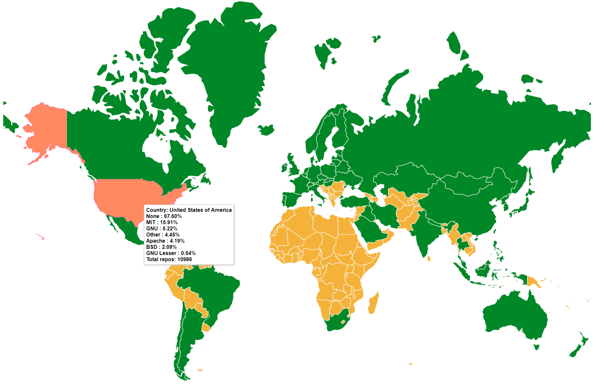

# Visualizing open source license usage in different countries
This is a small tool that uses GitHub's new APIv4 query system to grab user data from specific countries, and collect the number of different licenses used in their repos. I thought the percentage of people using GNU might be a useful metric in judging how 'open' people are in that country.

Note that one should use the statistics carefully. GitHub only allows for 1,000 user entries per search, so I can only grab 1,000 unique users from each country. To compensate for this, I grabbed the top 20 repositories of each user, sorted by the number of stars in each repo.

This would mean that it is not a great representation of the people in a country, as it is biased towards those that have a lot of repos.

Furthermore, I am trusting the users to be truthful about their location.

## Method
### 1. Grabbing data using GitHub APIv4 GraphQL
To get more data, go into /data, then run `python github_get start <location> 10`
### 2. Showing new data on DataMaps (built on D3)
In country_licenses.html, near the end of the file, add: `grabData(<location>, <location's iso alpha-3>)`. The iso alpha-3 code can be found [here](https://en.wikipedia.org/wiki/ISO_3166-1_alpha-3)
## Demo
1. Run `python -m http.server` to start your server
2. Go to your "http://localhost:8000/"
3. Click on country_licenses.html
4. Hover over the countries in green. It should show info on the country!
